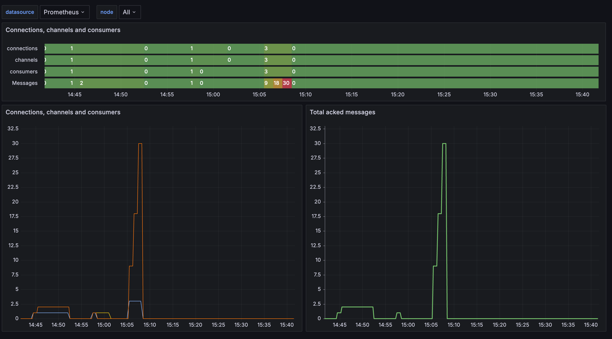

# 👨🏼‍🤝‍👨🏼 Nom des participants

  >- MANFO JIENGAP Rosvalde Florient
  >- FOUMBI DJOMO Ranyl Josué

# 🏗️ Architecture de l'application

  ## Composants :

1. **Client Vue.js :** Interface utilisateur interactive permettant aux utilisateurs de se connecter, envoyer et recevoir des messages.

2. **Serveur FastAPI :** Gère la logique métier, la persistance des données et la communication en temps réel avec les clients via WebSocket.

3. **RabbitMQ :** Système de messagerie pour la distribution des messages entre les clients connectés.

4. **Prometheus :** Système de monitoring et d'alerte pour enregistrer les métriques et surveiller l'état du système.

5. **Grafana :** Outil de visualisation des métriques et de création de tableaux de bord pour l'analyse et le monitoring en temps réel.

6. **Docker :** Outil de conteneurisation pour la structuration des services backend
 
## Structure du service RabbitMQ

  Les scripts d'envoi et de reception de message développés en **Python** comprennent :

1. Un **Exchange** nommé `chat` de type `fanout`
2. Des **Queues** dont les noms correspondent aux noms des utilisateurs connectés
3. Un objet **Message** ayant les propriétés:
 > - ***sent_at***: qui représente la date d'envoi du message, 
 > - ***content***: correspondant au contenu du message, 
 > - ***user_name***: qui représente l'utilisateur connecté. Il est également utilisé pour nommer la queue.

Les utilisateurs connectés sont à la fois **Producer** et **Consumer** étant donné qu'ils sont tous connectés au même **Exchange**

# 🚀 Exécution

## Service de messagerie
Depuis le repertoire ***backend*** utiliser la commande `docker-compose up` pour démarrer le serveur.

 - Le service **Grafana** est disponible à l'adresse   `localhost:3000` avec pour utilisateur ***admin*** mot de passe initial ***admin***.
 - Le service **RabbitMQ** est disponible à l'adresse `localhost:15672`.
 - Le service **Prometheus** est disponible à l'adresse `localhost:9090` et se connecte au service **RabbitMQ** sur le port `15692`.

## Client
Depuis le repertoire ***frontend*** utiliser la commande `npm run dev`